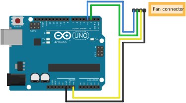
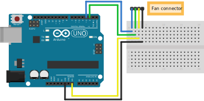
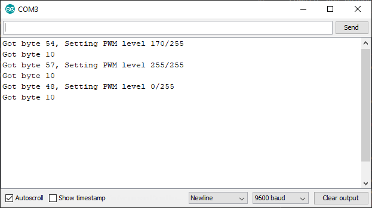

# PWM fan controller

An Arduino based PWM fan controller that is controlled through the USB serial port.

It reads characters that are sent to the serial port and reacts to characters between '0' (0% fan PWM level) and '9' (100% fan PWM level).

This example uses a [PWM library by Sam Knight](https://forum.arduino.cc/index.php?topic=117425.0).

## Theory

The pins of a 4-pin computer fan are as follows:

* Black - Ground
* Yellow - +12V (the fan might also work with lower voltages)
* Green - Tachometer, one pulse per full rotation of the fan
* Blue - Control

The control pin uses a 25 kHz [PWM](https://en.wikipedia.org/wiki/Pulse-width_modulation) signal. The amount of time that the signal is high determines the speed that the fan should run at.

The Arduino board has built in timers that allows it to generate such a signal in an easy way.

## Prerequisites

You need:

* An Arduino board. Most board types should work but for this example I will assume that you have an Arduino Uno or similar board.
* A 12V PWM controllable fan. Most standard 3 or 4 pin computer fans should work.
* A 12V power supply. Make sure that the connector matches in size and polarity with the Arduino power connector (5.5 mm, center positive).
* Connector wires. Use male-male connectors for connecting the Arduino to either the fan connector or to a breadboard.
* A USB cable.

Optionally:

* A breadboard.
* A 4-pin fan header (4-pin Molex KK 47053-1000).

## Wiring

You can connect the fan directly to the Arduino board. This works fine but the connector wires will not necessarily fit the fan connector perfectly. You may want to stablilize the connection with some electrical insulation tape.



If you can get hold of a fan header then you can place it on a breadboard and connect that to the Arduino instead.



## Software

* Install the [Arduino IDE](https://www.arduino.cc/en/software).

* Install the PWM library
  * Download the latest version from <http://code.google.com/p/arduino-pwm-frequency-library/downloads/list>.
  * Start the Arduino IDE.
  * Go to the menu item _Sketch - Include Library - Add .ZIP Library_.
  * Navigate to the downloaded zip file and add it to the IDE.

## Setup

* Connect the Arduino board to your computer using a USB cable.
* Connect the 12V power supply to the Arduino board.
  * Note that the connected fan will start turning as soon as you connect either a USB cable or the power supply. If you only have the USB cable connected then the fan will be powered by 5V resulting in a lower speed.
* Open the [fan-pwm.ino](fan-pwm.ino) sketch.
* Select the correct model of Arduino board using the menu item _Tools - Board_.
* Compile and upload the program by pressing the Upload button or the menu item _Sketch - Upload_.

## Control

* Select the correct serial port using the menu item _Tools - Port_. It might not always be obvious which port to use so you may have to try those that are available until you find the correct one.
* Open the serial monitor by pressing the Serial Monitor button or the menu item _Tools - Serial Monitor_.
* Select the same baud rate as is set up in the code. In this case it should be 9600.
* Send characters. The program reacts to the characters '0' to '9' which are mapped to a PWM level between 0 and 255. All other characters are ignored.
  * Note that the speed is not necessarily linear to the PWM level. Depending on the fan a PWM level of 0 may mean a completely stopped fan or a low rotation speed.



## Other control mechanisms

In this example we used the serial monitor to control the PWM level because it requires no additional hardware.

You can pretty easily add other sensors to control the fan. For example you can add a potentiometer that allows you to control the fan by turning a dial. Or you could add a temperature sensor that allows you to increase the fan speed if the temperature is too high.

## Monitoring fan speed

Note that we connected the tachometer pin to the Arduino even though we do not use it. It is possible to attach an interrupt to this pin in order to monitor the fan speed.

The following code increases the variable `tachCount` for every full rotation. In the main loop you can use this to calculate RPM values.

```c
#define TACH_PIN 2

volatile long tachCount = 0;

void tach() {
  tachCount++;
}

void setup(void) {
  // Add to setup method
  pinMode(TACH_PIN, INPUT_PULLUP);
  attachInterrupt(digitalPinToInterrupt(TACH_PIN), tach, RISING);
}
```
